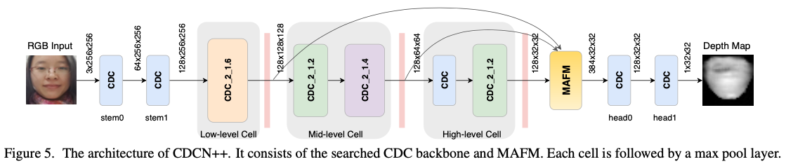

# Searching Central Difference Convolutional Networks for Face Anti-Spoofing

[CDCN](https://github.com/ZitongYu/CDCN) pytorch reimplementation. ([paper](https://arxiv.org/abs/2003.04092))



### Prerequisites

* pytorch 1.x
* opencv-python
* imgaug


## Run


```
python train_CDCN.py [--log LOG]
```


## Outputs

`LOG/LOG_log_P1.txt` : val/test log  
`LOG/LOG_EPOCH.pkl` : save models  
`LOG/LOG_x_Block#_visual.jpg` : Block# hidden feature map  
`LOG/LOG_x_DepthMap_visual.jpg` : output image for valid  
`LOG/LOG_x_visual.jpg` : input image for valid  

## Results

epoch:780, mini-batch: 50, lr=0.000050, Absolute_Depth_loss= 0.0027, Contrastive_Depth_loss= 0.0024  
epoch:780, mini-batch:100, lr=0.000050, Absolute_Depth_loss= 0.0031, Contrastive_Depth_loss= 0.0028  
epoch:780, mini-batch:150, lr=0.000050, Absolute_Depth_loss= 0.0031, Contrastive_Depth_loss= 0.0028  
epoch:780, Train: Absolute_Depth_loss= 0.0032, Contrastive_Depth_loss= 0.0028  

epoch:780, Val: val_threshold= 0.0023, val_ACC= 0.9956, val_ACER= 0.0069  
epoch:780, Test: ACC= 0.9900, APCER= 0.0084, BPCER= 0.0167, ACER= 0.0125  


